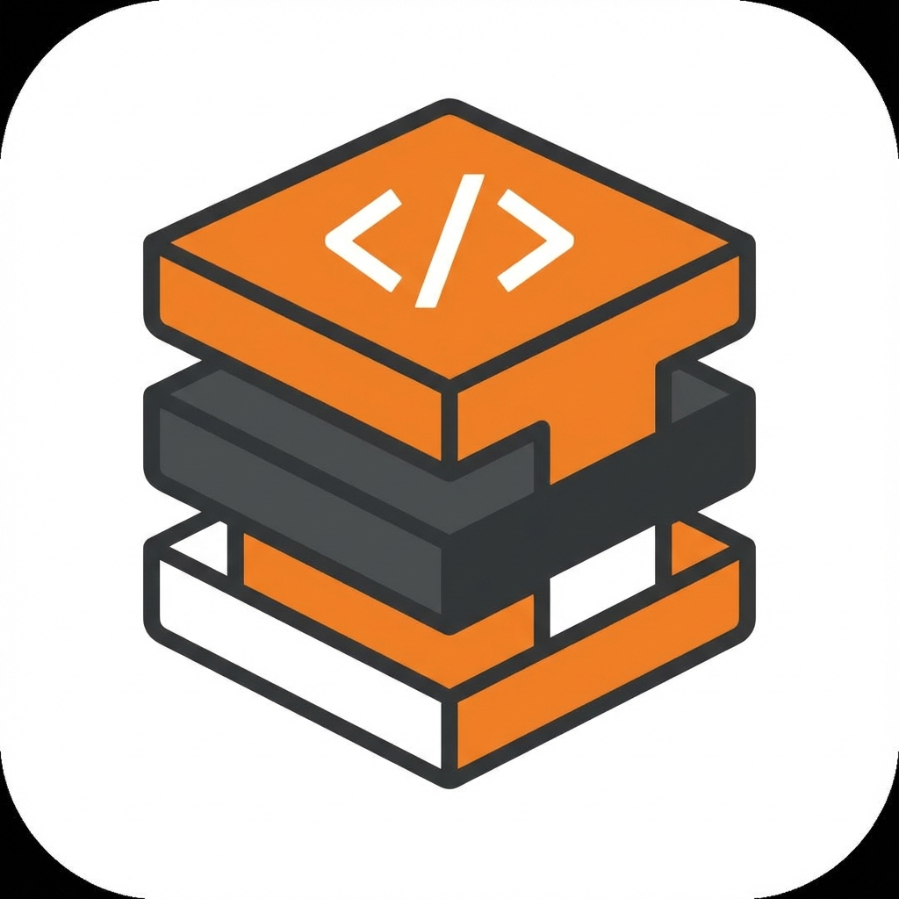

# Stack Overflow Search Pro 🚀

A professional, high-performance desktop application for searching Stack Overflow and Russian Stack Overflow simultaneously. Built with Python and PyQt6, compiled to a standalone executable for ease of use.



## ✨ Features

- **Bilingual Search**: Search usage on **Stack Overflow (English)** and **Stack Overflow (Russian)** at the same time.
- **High Performance**: Asynchronous multi-threaded searching ensures the UI never freezes.
- **Embedded Content**: View Questions, Answers, and Comments directly within the application.
- **Rich Syntax Highlighting**: Code blocks are automatically detected and highlighted (Python, C++, Java, etc.).
- **Smart Copy**: One-click copy for code blocks.
- **No Browser Needed**: Everything happens inside the clean, modern GUI.
- **Standalone**: Single `.exe` file, no Python installation required.

## 🛠 Installation

### User (Windows)
1. Download the latest `StackOverflowGUI.exe` from the [Releases](https://github.com/eminsk/StackOverflowAPI/releases) page.
2. Double-click to run. No installation required.

### Developer (Source)
To run from source:
```bash
# Clone repository
git clone https://github.com/eminsk/StackOverflowAPI.git
cd StackOverflowAPI

# Install dependencies (using uv)
uv sync

# Run
uv run main.py
```

## 🏗 Compilation

To build the executable yourself (requires Nuitka):

```bash
uv run build_exe.py
```

This will generate `StackOverflowGUI.exe` in the project root.

## 📋 Requirements

- Windows 10/11
- Internet connection (for API access)

## 📄 License

MIT License
